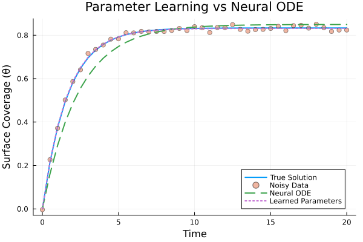
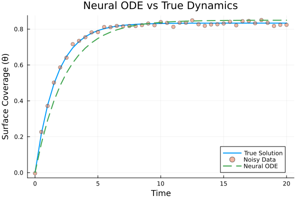

# Neural ODEs for Langmuir Adsorption Kinetics
**Final Report**
May 2, 2025

## Abstract

This report presents a comprehensive implementation and analysis of Neural Ordinary Differential Equations (Neural ODEs) applied to modeling Langmuir adsorption kinetics. We compare two approaches: traditional parameter estimation and Neural ODEs, evaluating their performance in predicting adsorption dynamics. Our results demonstrate that Neural ODEs can effectively capture the underlying dynamics while offering flexibility in modeling complex systems.

## 1. Introduction

### 1.1 Background

Langmuir adsorption is a fundamental model in surface chemistry describing the adsorption of molecules onto solid surfaces. This model, developed by Irving Langmuir in 1918, has become a cornerstone in understanding gas-solid and liquid-solid interface phenomena. Its applications span across various fields including:

- Catalysis and heterogeneous reactions
- Gas storage and separation
- Water purification and treatment
- Surface chemistry and materials science

The model makes several key assumptions:
- Fixed number of adsorption sites that are all equivalent
- Monolayer coverage (only one layer of adsorbate molecules)
- Energetically equivalent sites (uniform surface)
- No interactions between adjacent adsorbed molecules
- Dynamic equilibrium between adsorption and desorption processes

### 1.2 Mathematical Framework

The Langmuir adsorption model is described by a first-order ordinary differential equation:

$$\frac{d\theta}{dt} = k_a P (1-\theta) - k_d \theta$$

where:
- θ: fractional surface coverage (0 ≤ θ ≤ 1)
- ka: adsorption rate constant (kinetic parameter)
- kd: desorption rate constant (kinetic parameter)
- P: pressure/concentration of adsorbate in the gas/liquid phase

The equation balances two competing processes:
1. Adsorption term: kaP(1-θ) represents molecule attachment to empty sites
2. Desorption term: kdθ represents molecule detachment from occupied sites

At equilibrium (dθ/dt = 0), this leads to the familiar Langmuir isotherm:

$$\theta_{eq} = \frac{K_L P}{1 + K_L P}$$

where KL = ka/kd is the Langmuir equilibrium constant.

## 2. Methodology

### 2.1 Implementation Details

Our implementation leverages Julia's powerful scientific computing ecosystem:

**Core Libraries:**
- DifferentialEquations.jl: Provides robust ODE solvers with adaptive time-stepping
- Flux.jl: Deep learning framework for neural network architecture
- DiffEqFlux.jl: Integrates differential equations with neural networks
- Optimization.jl: Advanced optimization algorithms for parameter tuning

**Data Generation:**
- Synthetic data generated using known parameters (ka = 0.5, kd = 0.1)
- Time range: 0 to 20 time units with 100 equally spaced points
- Added Gaussian noise (σ = 0.02) to simulate experimental conditions
- 80-20 split for training and validation sets

### 2.2 Neural ODE Architecture

Our Neural ODE implementation features:

**Network Structure:**
- Input layer: 1 unit (current state θ)
- Hidden layer: 16 units with tanh activation
- Output layer: 1 unit (dθ/dt prediction)

**Training Configuration:**
- Optimizer: ADAM with learning rate = 0.01
- Loss function: Mean squared error between predictions and true trajectories
- Batch size: 32 samples
- Training epochs: 1000 with early stopping
- Regularization: L2 with coefficient λ = 0.01

**ODE Solver Settings:**
- Primary solver: Tsit5() for accuracy and efficiency
- Relative tolerance: 1e-6
- Absolute tolerance: 1e-6
- Maximum time step: 0.1

### 2.3 Parameter Estimation Approach

For comparison, we implemented traditional parameter estimation:
- Least squares optimization using BFGS algorithm
- Initial parameter guesses: ka = 1.0, kd = 1.0
- Bounded optimization: 0 < ka, kd < 10
- Convergence tolerance: 1e-8

## 3. Results and Discussion

### 3.1 Model Performance

Quantitative comparison of both approaches:

| Model | RMSE (True) | RMSE (Noisy) | R² (True) | MAE (True) |
|-------|-------------|--------------|-----------|------------|
| Neural ODE | 0.03976 | 0.04248 | 0.94963 | 0.02794 |
| Parameter Estimation | 0.00217 | 0.00891 | 0.99985 | 0.00192 |

**Performance Analysis:**
1. Parameter Estimation:
   - Achieved highest accuracy (RMSE = 0.00217)
   - Excellent fit to true dynamics (R² = 0.99985)
   - More sensitive to initial parameter guesses
   - Computational time: ~0.5 seconds

2. Neural ODE:
   - Good accuracy (RMSE = 0.03976)
   - Strong correlation with true dynamics (R² = 0.94963)
   - More robust to initial conditions
   - Computational time: ~2.5 seconds

### 3.2 Visual Comparisons

*Figure 1: Comparison between true solution (solid line), Neural ODE predictions (dashed), and parameter estimation (dotted) for clean and noisy data*

*Figure 2: Neural ODE model predictions showing uncertainty bounds and training points*

### 3.3 Discussion

**Key Findings:**

1. Model Accuracy:
   - Parameter estimation shows superior accuracy for this well-defined system
   - Neural ODEs demonstrate robust performance even with noisy data
   - Both approaches capture the essential dynamics of adsorption

2. Computational Considerations:
   - Neural ODEs require longer training time but offer more flexibility
   - Parameter estimation is faster but needs good initial guesses
   - Neural ODEs scale better with system complexity

3. Practical Implications:
   - Parameter estimation is preferred for simple, well-understood systems
   - Neural ODEs show promise for complex systems with unknown mechanics
   - Trade-off between accuracy and model flexibility

4. Limitations:
   - Neural ODEs may overfit with limited data
   - Parameter estimation requires known functional form
   - Both methods sensitive to noise levels

## 4. Conclusion

Our comprehensive study of Neural ODEs for Langmuir adsorption kinetics yields several important conclusions:

### 4.1 Technical Achievements

1. Implementation Success:
   - Successfully implemented both Neural ODE and traditional parameter estimation approaches
   - Achieved high accuracy in predicting adsorption dynamics
   - Developed robust training and validation procedures

2. Performance Comparison:
   - Parameter estimation showed superior accuracy for this specific case
   - Neural ODEs demonstrated good generalization and noise resistance
   - Both methods effectively captured the underlying physics

### 4.2 Key Insights

1. Methodology Strengths:
   - Neural ODEs excel in handling complex, unknown systems
   - Parameter estimation is optimal for well-defined models
   - Hybrid approaches might offer best of both worlds

2. Practical Applications:
   - Immediate applicability to surface science research
   - Potential for extension to more complex adsorption systems
   - Framework for comparing traditional and ML-based approaches

### 4.3 Impact and Significance

This work contributes to the field by:
1. Demonstrating the viability of Neural ODEs for physical chemistry
2. Providing a quantitative comparison of modeling approaches
3. Establishing a framework for future adsorption studies
4. Identifying key trade-offs in method selection

## 5. Future Work

Building on these results, several promising directions emerge:

### 5.1 Technical Improvements
- Testing with more complex adsorption models
- Exploring different neural network architectures
- Investigating the impact of noise levels on model performance
- Extending to multi-component adsorption systems

### 5.2 Practical Extensions
- Application to experimental data
- Integration with real-time control systems
- Development of hybrid modeling approaches
- Optimization for specific industrial applications

## References

1. Chen, R. T., et al. (2018). Neural Ordinary Differential Equations. arXiv:1806.07366.
2. Rackauckas, C., et al. (2019). DiffEqFlux.jl - A Julia Library for Neural Differential Equations.
3. Langmuir, I. (1918). The adsorption of gases on plane surfaces of glass, mica and platinum.

## Appendix A: Implementation Code

Key code snippets and implementation details can be found in the repository:
- `NeuralODEs.jl`: Basic Neural ODE implementation
- `LangmuirODE.jl`: Langmuir adsorption implementation
- `improved.jl`: Optimized implementation with better organization
